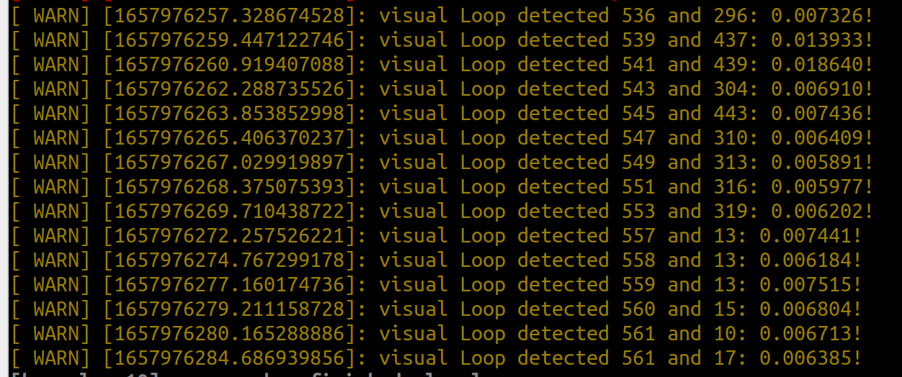

# LIO-SAM-6AXIS-INTENSITY
[LIO-SAM-6AXIS](https://github.com/JokerJohn/LIO_SAM_6AXIS) with intensity image-based  loop optimization. 

This repo integrates [LIO-SAM](https://github.com/TixiaoShan/LIO-SAM) and [Imaging_lidar_place_recognition](https://github.com/TixiaoShan/imaging_lidar_place_recognition) to achieve better mapping and localization result for SLAM system. Thanks for their hard work！


（**red line segments** are for visual loop constraint from intensity image）

# Introdction

This repo may help to build more accurate point cloud maps by introducing the intensity-based visual loop constraint.

- contain all the functions of the [LIO-SAM-6AXIS](https://github.com/JokerJohn/LIO_SAM_6AXIS).
- support the intensity loop detection method with ICP refine to get the robust loop constriant and add them to the factor graph.



## Dependency

- **OpenCV3.x**(OpenCV4.x is also available, but a small amount of API may need to be modified for the Brief descriptor related library)

- **DBoW3**（Please note that the C++ version is lower than 17）

  ```
  cd ~/Downloads/
  git clone https://github.com/rmsalinas/DBow3.git
  cd ~/Downloads/DBow3/
  mkdir build && cd build
  cmake -DCMAKE_BUILD_TYPE=Release ..
  sudo make install
  ```

## Run

In the `LIO_SAM_6AXIS/LIO-SAM-6AXIS/launch/ouster128_indoors.launch`, just set your `bag_path` and `sequence`.(Other configuration files are not ready, be careful not to use them)

```bash
roslaunch lio_sam_6axis ouster128_indoors.launch
```

for this config file `LIO_SAM_6AXIS/LIO-SAM-6AXIS/config/indoor_ouster128.yaml`.The parameter configuration method is the same as that of the  [Imaging_lidar_place_recognition](https://github.com/TixiaoShan/imaging_lidar_place_recognition) system, and the brief descriptor and ORB feature matching are enabled at the same time indoors. The brief descriptor matching is consistent with VINS-MONO.

```bash
  # Feature matching
  use_brief: 1                    # enabling flag for BRIEF feature
  use_orb: 1                      # enabling flag for ORB feature
  num_bri_features: 200           # feature num for BRIEF
  num_orb_features: 500           # feature num for ORB

  # Loop settings
  min_loop_feature_num: 20        # minimum feature number threshold
  min_loop_bow_th: 0.015          # BOW search threshold
```

# Discussion

The system also has the following problems

- Effective for high-beam lidars, but poor for low-beam lidars such as VLP16

- Effective for indoor scenes, many closed-loop constraints found are better than the original ICP method, and the performance is poor in outdoor open scenes.

- It must be ensured that the number of point clouds is equal to the number of pixels of the intensity image.

- In the outdoor scene, the resolution of the intensity image is too low, so it is difficult to achieve the place recognition stably

We analyze why it is effective in indoor scenarios: 

1. There is no extrinsic error when the lidar is projected to the intensity image compared to RGB camera.
2. Each pixel of the intensity image corresponds to a unique lidar point. So there is an accurate depth, and the feature matching performance is good after the outlier rejection by PNPRansanc .


# Dataset

**Fusion Portable(IROS 2022)**：


I will upload some test rosbag later!
